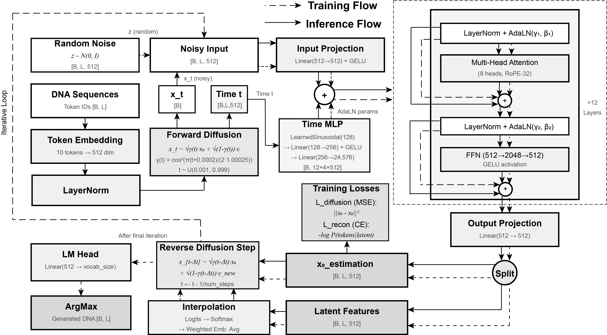

# DiPro: Diffusion-based DNA Promoter Sequence Generator

DiPro is a diffusion language model designed for DNA promoter sequence generation and completion. It leverages the power of denoising diffusion probabilistic models combined with transformer architecture to learn the complex patterns in promoter sequences.


## Model Architecture



DiPro employs a 12-layer Transformer with Adaptive Layer Normalization (AdaLN) conditioned on diffusion timesteps. Key features include:

- **Embedding**: 512-dimensional token embeddings with LayerNorm
- **Transformer**: 12 layers, 8 attention heads, RoPE positional encoding
- **Time Conditioning**: Learned sinusoidal embeddings → MLP → AdaLN parameters
- **Diffusion**: Cosine noise schedule with interpolation-based denoising
- **Training Losses**: MSE (diffusion) + Cross-Entropy (reconstruction)

## Pretrained Model

Download the pretrained model from Hugging Face:

| Model | Description | Link |
|-------|-------------|------|
| DiPro | Base checkpoint | [Download](https://huggingface.co/lixinxin/DiPro/resolve/main/DiPro) |
| DiPro_ema | EMA checkpoint (recommended) | [Download](https://huggingface.co/lixinxin/DiPro/resolve/main/DiPro_ema) |

Or use Hugging Face CLI:
```bash
huggingface-cli download lixinxin/DiPro --local-dir generation/model
```

## Quick Start with Docker (Recommended)

Docker provides a one-command setup with all dependencies pre-configured, eliminating compatibility issues.

**Build the image:**
```bash
docker build -t dipro .
```

**Generate promoter sequences (GPU):**
```bash
docker run --gpus all -v dipro_models:/app/generation/model \
    -v $(pwd)/output:/app/output dipro \
    generate --num_examples 100 --num_steps 1000 --output_csv_path output/generated.csv
```

**Generate promoter sequences (CPU only):**
```bash
docker run -v dipro_models:/app/generation/model \
    -v $(pwd)/output:/app/output dipro \
    generate --num_examples 100 --num_steps 1000 --output_csv_path output/generated.csv
```

**Sequence inpainting:**
```bash
docker run --gpus all -v dipro_models:/app/generation/model \
    -v $(pwd)/data:/app/data dipro \
    inpaint --input_csv data/partial.csv --output_csv data/completed.csv --num_steps 1000
```

**Train on custom data:**
```bash
docker run --gpus all -v dipro_models:/app/generation/model \
    -v $(pwd)/data:/app/data dipro \
    train --data_path data/my_promoters.csv --epochs 500
```

The pretrained model is automatically downloaded from Hugging Face on first run and cached in the `dipro_models` Docker volume for reuse.

**Available commands:** `generate`, `inpaint`, `train`, `template`, `--help`

## Installation (Manual)

```bash
pip install -r requirements.txt
```

Or install directly:
```bash
pip install torch pandas tqdm sentencepiece rotary-embedding-torch huggingface_hub
```

## Usage

### Training

Train or fine-tune the model on your DNA sequence dataset:

```bash
python DiPro_train.py \
    --checkpoint generation/model/DiPro \
    --data_path dataset/your_data.csv \
    --batch_size 256 \
    --gradient_accumulation_steps 2 \
    --epochs 1000 \
    --save_every 200 \
    --augment_factor 10 \
    --use_dna_augmentation true \
    --learning_rate 2e-4 \
    --warmup_steps 2000 \
    --use_ema true \
    --ema_decay 0.9999
```

**Key Parameters:**
| Parameter | Description | Default |
|-----------|-------------|---------|
| `--batch_size` | Training batch size | 128 |
| `--epochs` | Number of training epochs | 500 |
| `--augment_factor` | Data augmentation multiplier | 3 |
| `--use_dna_augmentation` | Enable reverse complement augmentation | true |
| `--use_ema` | Enable Exponential Moving Average | true |
| `--learning_rate` | Peak learning rate | 2e-4 |

### Generation

Generate novel DNA sequences unconditionally:

```bash
python DiPro_generate.py \
    --checkpoint generation/model/DiPro \
    --output_csv_path generation/generated_sequences.csv \
    --num_examples 6000 \
    --batch_size 200 \
    --num_steps 1000 \
    --use_ema true
```

**Key Parameters:**
| Parameter | Description | Default |
|-----------|-------------|---------|
| `--num_examples` | Number of sequences to generate | 500 |
| `--num_steps` | Diffusion sampling steps (higher = better quality) | 500 |
| `--use_ema` | Use EMA checkpoint for generation | true |

### Sequence Inpainting

Complete partial DNA sequences with masked regions:

**Step 1: Create inpainting template**
```bash
python create_inpaint_template.py \
    --output generation/partial_sequences.csv \
    --num_samples 100 \
    --mask_mode middle
```

Mask modes: `middle` (center region), `ends` (both ends), `random` (30% random positions), `pattern` (every 3rd base)

**Step 2: Run inpainting**
```bash
python DiPro_inpaint.py \
    --checkpoint generation/model/DiPro \
    --input_csv generation/partial_sequences_input.csv \
    --output_csv generation/completed_sequences.csv \
    --num_steps 1000 \
    --use_ema true
```

**Input CSV format:**
```csv
sequence,mask
ATCGNNNNNNNNATCG,4-11
NNNNNATCGATCGNNNN,0-4,13-17
```

## Project Structure

```
DiPro/
├── Dockerfile                  # Docker container configuration
├── entrypoint.sh               # Docker entrypoint with auto model download
├── requirements.txt            # Python dependencies
├── DiPro_train.py              # Training script
├── DiPro_generate.py           # Generation script
├── DiPro_inpaint.py            # Sequence inpainting script
├── create_inpaint_template.py  # Inpainting template generator
├── dataset/
│   └── wxl.csv                 # Training data
└── generation/
    ├── model/
    │   ├── DiPro               # Model checkpoint
    │   └── DiPro_ema           # EMA checkpoint
    └── script/
        ├── DiffusionLM.py      # Model architecture
        ├── emb_tokenizer.py    # Tokenizer and data loading
        ├── ema.py              # EMA implementation
        └── utils.py            # Utilities
```

## License

MIT License

